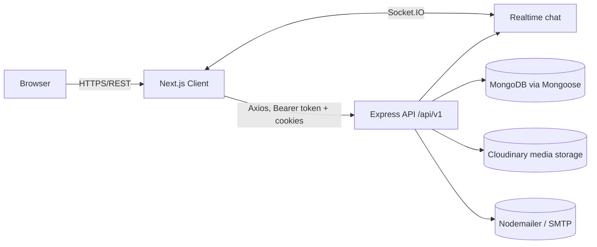
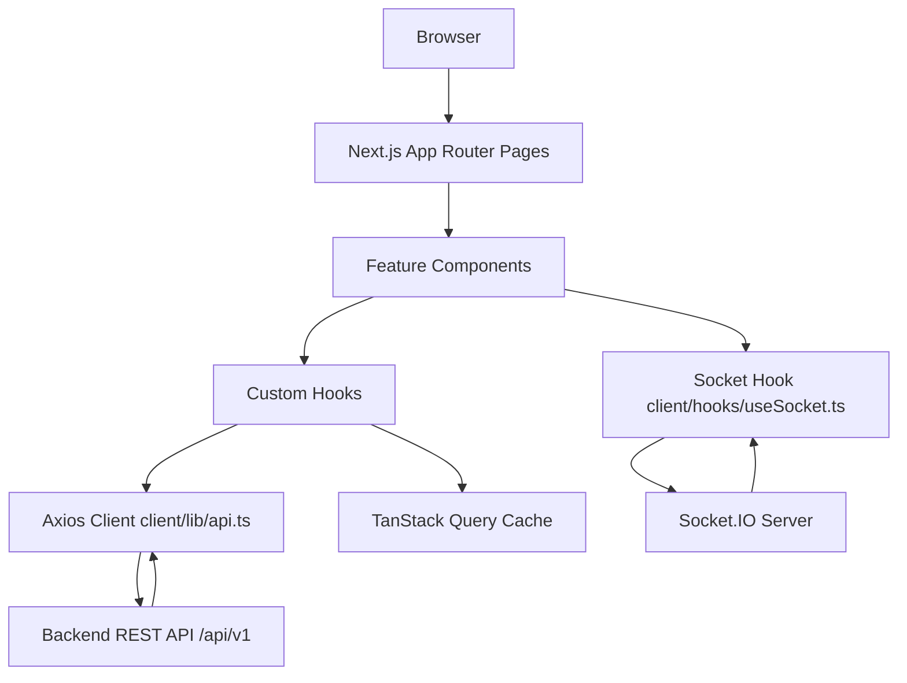

# Architecture

## Overview

COG (Scripture School LMS) is a two-tier application:

- **`client/`** — Next.js 15 App Router frontend, React 19 + TypeScript, deployed as a standalone Node server (see [client/DockerFile](../client/DockerFile)).
- **`server/`** — Express 5 REST API + Socket.IO, TypeScript, MongoDB via Mongoose (see [server/src/server.ts](../server/src/server.ts)).

## Backend Bootstrap

`server/src/server.ts` builds the Express app and an HTTP server that both Express and Socket.IO share:

- Middleware order: `cors` → `cookie-parser` → `helmet` → `compression` → `express.json`/`urlencoded` (200mb limit) → custom rate limiter ([server/src/lib/express_rate_limit.ts](../server/src/lib/express_rate_limit.ts)).
- Health check: `GET /health` (plain) and `GET /api/v1/health` (API-level, lists all mounted route prefixes — see [server/src/routes/v1/index.ts](../server/src/routes/v1/index.ts)).
- All API routes are mounted under `/api/v1` via `v1Routes`.
- `notFoundHandler` and `errorHandler` ([server/src/middleware/errorHandler.ts](../server/src/middleware/errorHandler.ts)) run last.
- Socket.IO server is created on the same HTTP server and initialized via `initializeSocketIO` ([server/src/lib/socket.ts](../server/src/lib/socket.ts)).
- Graceful shutdown handles `SIGTERM`/`SIGINT`/`uncaughtException`: closes Socket.IO, closes the HTTP server, then disconnects MongoDB ([server/src/lib/mongoose.ts](../server/src/lib/mongoose.ts)).

## Backend Folder Responsibilities (`server/src`)

| Folder | Responsibility |
|---|---|
| `config/` | Environment-driven config object (`config.ts`) — port, DB URL, JWT secrets/expiry, CORS whitelist. |
| `routes/v1/` | Express routers, one subfolder per domain (auth, admin, superAdmin, teachers, students, grade, chapter, teacherChapter, assignment, submission, announcement, attendance, teacherAttendance, chat, queries, todo, dashboard). Mounted centrally in `routes/v1/index.ts`. |
| `controllers/v1/` | Request handlers referenced by the routers, mirroring the same domain folders. |
| `models/` | Mongoose schemas, grouped by domain: `academic/` (Chapter, Grade, TeacherChapter, Unit), `user/` (Admin, Student, Teacher, User), `auth/` (Token, PasswordResetToken), plus `announcement.ts`, and further `assignment/`, `attendance/`, `chat/`, `query/`, `shared/` subfolders. |
| `middleware/` | `authenticate.ts` (JWT access/refresh handling), `authorizeRoles.ts` (role-based access control), `errorHandler.ts`, `profanity.ts`, `upload.ts` (Multer/Cloudinary), `validate.ts` (express-validator wrapper). |
| `lib/` | Cross-cutting infra: `mongoose.ts` (connect/disconnect), `socket.ts` (Socket.IO init), `express_rate_limit.ts`, `chat.service.ts`, `mail/`. |
| `migrations/` | One-off data migration scripts, e.g. `addCascadingDeletes.migration.ts`, run via `npm run migrate`. |
| `utils/` | Shared helper functions (e.g. JWT signing/verification used by `middleware/authenticate.ts`). |
| `@types/` | Custom/ambient TypeScript type declarations. |

## Authentication & Authorization Flow

Implemented in [server/src/middleware/authenticate.ts](../server/src/middleware/authenticate.ts) and [server/src/middleware/authorizeRoles.ts](../server/src/middleware/authorizeRoles.ts):

1. `authenticate` reads the access token from the `Authorization: Bearer <token>` header, falling back to an `accessToken` cookie.
2. If the access token is valid, it decodes `userId` and attaches it to `req.userId`.
3. If the access token is missing/expired, it looks up a stored refresh token (`Token` model) via the `refreshToken` cookie, verifies it, and — if valid — issues new access and refresh tokens (rotation), updating the stored token.
4. If no valid token chain exists, it clears auth cookies and responds `401 AuthenticationError`.
5. `authorizeRoles(...roles)` runs after `authenticate`, loads the `User` by `req.userId`, and rejects with `403` if the user's `role` is not in the allowed list.

Cookie behavior: `httpOnly` always; `secure` and `sameSite: "none"` only in production, otherwise `sameSite: "lax"`. Access token cookie max-age 15 minutes, refresh token 30 days (see `TOKEN_CONFIG` in `authenticate.ts`).

## Frontend Architecture (`client/`)

- **App Router pages** (`client/app/**/page.tsx`) call domain hooks/components.
- **Hooks** (`client/hooks/**`) wrap TanStack Query (`useQuery`/`useMutation`) around calls to the Axios client.
- **API client** ([client/lib/api.ts](../client/lib/api.ts)) is a single Axios instance with `baseURL = process.env.NEXT_PUBLIC_SERVERURL`, `withCredentials: true`, a request interceptor that attaches `Authorization: Bearer <token>` from `localStorage`, and a response interceptor that performs a 401-triggered token refresh with a queued-retry mechanism (excluding `/auth/login`, `/auth/verify`, `/auth/refresh`, `/auth/forgot-password`, `/auth/reset-password`).
- **Realtime**: [client/hooks/useSocket.ts](../client/hooks/useSocket.ts) manages the Socket.IO client connection used by chat pages.
- **Providers**: [client/providers/query-provider.tsx](../client/providers/query-provider.tsx) wraps the app in a `QueryClientProvider` (staleTime 60s, no refetch-on-focus, retry 1), applied in [client/app/layout.tsx](../client/app/layout.tsx) alongside a `sonner` `Toaster`.

## Known Architectural Notes

- Two separate frontend auth hooks exist: [client/hooks/useAuth.ts](../client/hooks/useAuth.ts) and [client/hooks/auth/useAuth.ts](../client/hooks/auth/useAuth.ts) — both are actively imported from different pages/layouts.
- `docker-compose.yml` references `./backend` and `./frontend` build contexts, which do not match the actual `server`/`client` folder names in this repository (see [DEPLOYMENT.md](./DEPLOYMENT.md)).
- The client only calls `/api/v1/...` implicitly via `NEXT_PUBLIC_SERVERURL`; the exact base path convention should include `/api/v1` per `server/src/server.ts` (`app.use("/api/v1", v1Routes)`).
