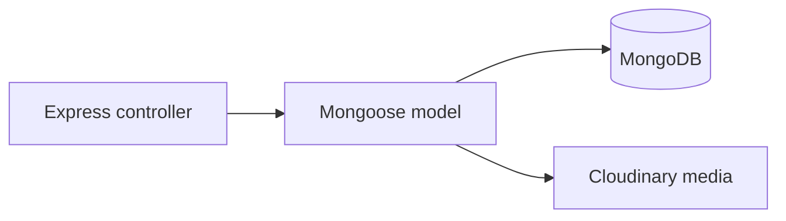
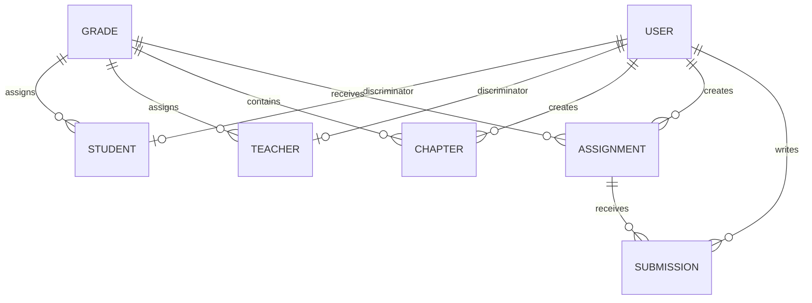

# Database Structure

## Overview

The server uses MongoDB through Mongoose. Application models define document shape, validation, indexes, relationships, and cleanup behavior. The database stores operational data; uploaded videos, PDFs, and images are stored in Cloudinary and their URLs and public IDs are saved in MongoDB documents.



## Connection Lifecycle

The application starts in [server/src/server.ts](../server/src/server.ts). Before the HTTP server accepts requests, `bootstrap()` calls `connectToDatabase()` from [server/src/lib/mongoose.ts](../server/src/lib/mongoose.ts). Mongoose creates and shares the MongoDB connection for all models and controllers.

Connection settings are loaded from [server/src/config/config.ts](../server/src/config/config.ts):

- `MONGO_URI` supplies the MongoDB server connection string. Its development fallback is `mongodb://localhost:27017/cogDb`.
- `dbName: "scriptureschool"` is explicitly passed to Mongoose, so it overrides the database name in `MONGO_URI` when present.
- `appName: "scriptureschool"` identifies the application to MongoDB.
- During shutdown, the server closes Socket.IO, the HTTP server, and then calls `mongoose.disconnect()`.

## Data Modeling

MongoDB uses collections of JSON-like documents. This project combines two relationship styles:

- **References:** an `ObjectId` stored in one document points to a document in another collection. For example, `Assignment.gradeId` references `Grade`.
- **Embedded documents:** related data is nested directly in the parent document. For example, a grade embeds `units`, and a chapter embeds content items, questions, and student-progress records.

Use references when data is independently queried or updated. Use embedded data when it belongs to one parent and is normally read with that parent.

## Core Collections and Relationships



| Model / collection | Main fields and relationships |
|---|---|
| `User` / `users` | Shared account document: `name`, unique `email`, hashed `password`, `role`, profile fields, and timestamps. Defined in [server/src/models/user/User.model.ts](../server/src/models/user/User.model.ts). |
| `Student` / `users` | A Mongoose `User` discriminator, not a separate collection. Adds `rollNumber`, `parentContact`, and optional `gradeId` referencing `Grade`. |
| `Teacher` / `users` | A `User` discriminator. Adds qualifications, specializations, required `gradeId`, and `createdBy`. |
| `Grade` / `grades` | Grade metadata plus embedded `units[]`, `isActive`, and academic year. Defined in [server/src/models/academic/Grade.model.ts](../server/src/models/academic/Grade.model.ts). |
| `Chapter` / `chapters` | References a `gradeId`, an embedded unit by `unitId`, and its creator via `createdBy`. Embeds learning content, questions, and per-student progress. Defined in [server/src/models/academic/Chapter.model.ts](../server/src/models/academic/Chapter.model.ts). |
| `Assignment` / `assignments` | References `gradeId` and `createdBy`; stores content metadata, timing, marks, status, and optional Cloudinary URLs/public IDs. Defined in [server/src/models/assignment/Assignment.schema.ts](../server/src/models/assignment/Assignment.schema.ts). |
| `Submission` / `submissions` | Connects a student to an assignment and stores submitted content and grading data. |
| `Attendance` and `TeacherAttendance` | Attendance records reference the relevant user and grade. |
| `Announcement`, `Query`, `ChatRoom`, `Message` | Cross-user communication and messaging documents. |
| `Token` and `PasswordResetToken` | Authentication session and password-reset records associated with users. |

## User Discriminators

`User` uses `role` as Mongoose's discriminator key. Student, teacher, admin, and super-admin documents share the `users` collection and common login fields, while each role can define its own additional fields. This avoids duplicating credentials and user identity data across multiple collections.

For example, a teacher document includes both the common account data and teacher-specific data:

```json
{
  "_id": "teacherObjectId",
  "name": "Jane Teacher",
  "email": "jane@example.com",
  "role": "teacher",
  "gradeId": "gradeObjectId",
  "qualifications": "M.Div."
}
```

## Embedded Structures

`Grade.units` is an embedded array. A unit has its own subdocument `_id`, and chapters save that identifier as `unitId`. Units are not independently stored as a MongoDB collection, even though `Chapter.unitId` names `Unit` as its reference.

`Chapter` embeds several structures that are read and updated with the chapter:

- `contentItems`: text, video, PDF, or mixed learning material.
- `questions`: quiz question documents.
- `studentProgress`: each student's status, dates, score, answers, and chapter-level submissions.

## Indexes and Validation

Schemas enforce data rules at the persistence layer. Examples include:

- `User.email` is unique and indexed; `role` is indexed for role-based lookups.
- `Student` enforces a unique `(rollNumber, gradeId)` pair when both values exist.
- `Assignment` indexes `gradeId`, `createdBy`, status, and dates for dashboard and filtered-list queries.
- `Chapter` indexes `gradeId`, `unitId`, `createdBy`, and publication state.
- Mongoose validates enums, required fields, date ranges, mark ranges, and content-specific required fields before saving.

## Deletion and Cleanup

MongoDB does not automatically cascade deletes between these collections. This project implements cascading cleanup with Mongoose middleware. For example:

- Deleting a grade removes associated assignments, submissions, attendance, chapters, teacher-chapter records, chats, and related Cloudinary media.
- Deleting a teacher removes created assignments and chapters, related submissions and attendance, teacher-progress records, and media.
- Deleting a student removes submissions and attendance, deletes progress embedded in chapters, and removes uploaded media.
- Deleting an assignment deletes its submissions and associated Cloudinary files.

The hooks are defined on the corresponding models, such as [server/src/models/academic/Grade.model.ts](../server/src/models/academic/Grade.model.ts) and [server/src/models/assignment/Assignment.schema.ts](../server/src/models/assignment/Assignment.schema.ts). Delete records through Mongoose model methods so these hooks run; bypassing them directly in MongoDB can leave dependent data and media behind.