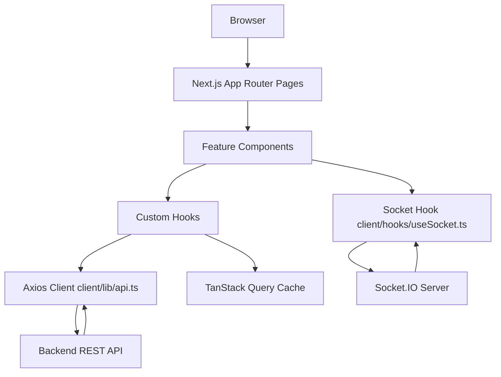
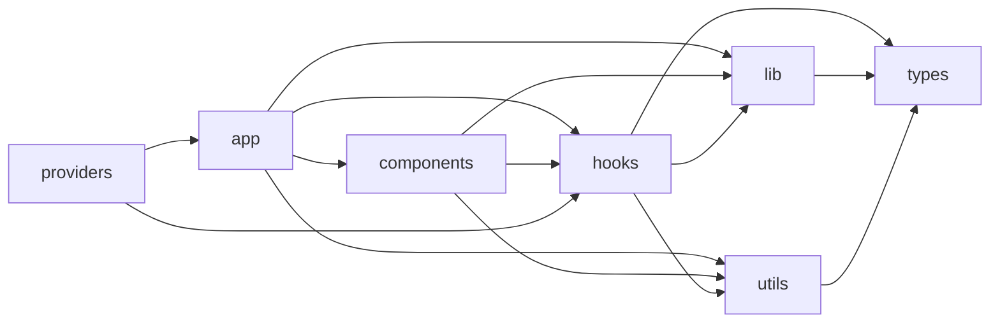

# Project Documentation

Scope: This documentation is derived from the current codebase in client (Next.js React project) and frontend-observable backend integration points. If a detail could not be verified from code, it is marked as "Not found in the current project."

## 1. Project Overview
- Purpose of the application: Scripture School LMS with role-based dashboards for admin, super-admin, teacher, and student users.
- Main business functionality: authentication, announcements, assignments/submissions, chapters/content delivery, attendance, queries/tickets, chat, profile management, grade reports, and role-specific admin workflows.
- Tech stack: Next.js 15, React 19, TypeScript, Tailwind CSS v4, Radix UI/shadcn-style components, TanStack Query, Axios, Socket.IO client, Sonner, Recharts, XLSX.
- High-level architecture: App Router pages call domain hooks/components, hooks call client/lib/api.ts (Axios client), and data is fetched from backend REST endpoints; realtime features use client/hooks/useSocket.ts.

## 2. Folder Structure
| Folder | Responsibility | Important files |
|---|---|---|
| client/app | App Router pages and layouts | client/app/layout.tsx, client/app/dashboard/layout.tsx, client/app/page.tsx |
| client/components | Reusable and feature components | client/components/dashboard/*, client/components/shared/* |
| client/components/ui | UI primitive wrappers (Radix based) | button, dialog, tabs, input, select, etc. |
| client/hooks | Domain hooks (admin/student/teacher/auth + shared) | client/hooks/auth/useAuthQuery.ts, client/hooks/admin/* |
| client/lib | API client, constants, validators, shared helpers | client/lib/api.ts, client/lib/auth/constant/auth.ts |
| client/providers | App-level providers | client/providers/query-provider.tsx |
| client/types | TypeScript contracts by domain | client/types/admin/*, client/types/student/*, client/types/teacher/* |
| client/utils | Domain utilities and service helpers | client/utils/admin/*, client/utils/student/*, client/utils/teacher/* |
| client/public | Static assets | logos/images used by pages |
| server/src | Backend consumed by frontend | controllers, middleware, routes (frontend integration references) |

## 3. Application Flow
- How the application starts: client/app/layout.tsx loads global styles/fonts and wraps children in QueryProvider and Toaster.
- Entry point: client/app/page.tsx decides between /dashboard and /login based on auth state.
- Routing flow: authentication pages at root-level plus role-based routes under /dashboard/{admin|super-admin|teacher|student}/...
- Authentication flow: token/user in localStorage, verify via /auth/verify, refresh behavior in Axios interceptor, logout via /auth/logout.
- Navigation flow: dashboard layout renders Sidebar + DashboardHeader and role-specific content.

## 4. Component Architecture
- Reusable components: shared status/loading/message components in client/components/shared and dashboard shell components in client/components/dashboard.
- Layout components: root layout and dashboard layout.
- Feature components: domain-focused modules under client/components/admin, client/components/student, client/components/teacher, client/components/queries.
- Shared UI components: client/components/ui contains generalized primitives and controls.

## 5. State Management
- State management library used: TanStack Query + React local state hooks.
- Global state: QueryClient from client/providers/query-provider.tsx.
- Local state: useState/useMemo/useCallback/useEffect used extensively in pages/components/hooks.
- Contexts: QueryClientProvider exists. Additional custom React contexts were not found in the current project.
- Redux/TanStack Query/Zustand/etc.: TanStack Query is used. Redux/Zustand were not found in the current project.
- Data flow: page -> hook -> api client -> backend -> query cache -> UI.

## 6. API Layer
- API structure: centralized Axios client in client/lib/api.ts.
- Services: API calls live in domain hooks and service modules under client/lib and client/utils.
- API client: uses NEXT_PUBLIC_SERVERURL and sends Authorization bearer token from localStorage.
- Request/response handling: response interceptor handles 401 refresh flow and request retry queue.
- Authentication: verify and logout endpoints integrated in auth hooks and interceptor.
- Error handling: refresh failure clears auth and redirects to /login; feature code uses try/catch and toast errors.

## 7. Pages
Note: Purpose below is inferred strictly from route names and imported modules.

| Route | File | Purpose | Components used | API calls | State | User interactions |
|---|---|---|---|---|---|---|
| /dashboard | client/app/dashboard/page.tsx | Route page inferred from path and imported modules. | admin-dashboard, student-dashboard, teacher-dashboard, admin-dashboard | Not found in the current project. | useEffect | click, navigate |
| /dashboard/admin/announcements | client/app/dashboard/admin/announcements/page.tsx | Route page inferred from path and imported modules. | admin/announcemnets/AnnouncementHeader, admin/announcemnets/AnnouncementFormModal, admin/announcemnets/AnnouncementLoading, admin/announcemnets/AnnouncementCard | Not found in the current project. | useState, useMemo | submit |
| /dashboard/admin/assignments | client/app/dashboard/admin/assignments/page.tsx | Route page inferred from path and imported modules. | ui/button, ui/input, ui/label, ui/badge | Not found in the current project. | useState | click, change, navigate |
| /dashboard/admin/assignments/create | client/app/dashboard/admin/assignments/create/page.tsx | Route page inferred from path and imported modules. | ui/button, ui/card, ui/input, ui/label | Not found in the current project. | Not found in the current project. | click, change, submit, navigate |
| /dashboard/admin/assignments/edit/[id] | client/app/dashboard/admin/assignments/edit/[id]/page.tsx | Route page inferred from path and imported modules. | ui/alert, ui/button, ui/card, ui/input | Not found in the current project. | useState, useEffect | click, change, submit, navigate |
| /dashboard/admin/assignments/submissions/[id] | client/app/dashboard/admin/assignments/submissions/[id]/page.tsx | Route page inferred from path and imported modules. | Not found in the current project. | Not found in the current project. | Not found in the current project. | Not found in the current project. |
| /dashboard/admin/attendance | client/app/dashboard/admin/attendance/page.tsx | Route page inferred from path and imported modules. | shared/LoadingComponent, teacher/mychapter/ErrorState | Not found in the current project. | useState | click |
| /dashboard/admin/chapters | client/app/dashboard/admin/chapters/page.tsx | Route page inferred from path and imported modules. | ui/card, ui/button, ui/input, shared/LoadingComponent | Not found in the current project. | useState | click, change, keydown, navigate |
| /dashboard/admin/chapters/edit/[id] | client/app/dashboard/admin/chapters/edit/[id]/page.tsx | Route page inferred from path and imported modules. | ui/button, admin/chapters/EditQuestionsSection, admin/chapters/EditContentSection, shared/LoadingComponent | Not found in the current project. | useEffect | submit, navigate |
| /dashboard/admin/chapters/scores/[id] | client/app/dashboard/admin/chapters/scores/[id]/page.tsx | Route page inferred from path and imported modules. | ui/tabs, ui/button, admin/chapters/ExportButtons, admin/chapters/StatisticsCards | Not found in the current project. | Not found in the current project. | click |
| /dashboard/admin/chapters/submissions/[id] | client/app/dashboard/admin/chapters/submissions/[id]/page.tsx | Route page inferred from path and imported modules. | ui/button, shared/LoadingComponent, admin/chapters/SubmissionsList | Not found in the current project. | Not found in the current project. | click |
| /dashboard/admin/chapters/upload | client/app/dashboard/admin/chapters/upload/page.tsx | Route page inferred from path and imported modules. | ui/alert, ui/button, admin/chapters/QuestionsSection, admin/chapters/BasicInfoSection | Not found in the current project. | useEffect | submit, navigate |
| /dashboard/admin/chat | client/app/dashboard/admin/chat/page.tsx | Route page inferred from path and imported modules. | shared/ConnectionStatus, shared/MessageBubble, shared/MessageInput | get /grades/all; get /teachers; get /students; get /chat/unread-count; get /chat/grade/${gradeId}; get /chat/conversation/${userId}; post /chat/grade; post /chat/unicast | useState, useEffect | click, change |
| /dashboard/admin/gradeReport | client/app/dashboard/admin/gradeReport/page.tsx | Route page inferred from path and imported modules. | ui/button, ui/input | Not found in the current project. | useState | click, change |
| /dashboard/admin/grades | client/app/dashboard/admin/grades/page.tsx | Route page inferred from path and imported modules. | ui/input, ui/button, ui/label, ui/textarea | Not found in the current project. | useState | click, change, keydown |
| /dashboard/admin/profile | client/app/dashboard/admin/profile/page.tsx | Route page inferred from path and imported modules. | ui/input, ui/label, ui/button, ui/avatar | put /admins/${user?.id} | useState, useEffect | click, change |
| /dashboard/admin/queries | client/app/dashboard/admin/queries/page.tsx | Route page inferred from path and imported modules. | queries/StatCard, queries/FilterBar, queries/QueryCard, queries/QueryDetailModal | Not found in the current project. | useState | click |
| /dashboard/admin/students | client/app/dashboard/admin/students/page.tsx | Route page inferred from path and imported modules. | Not found in the current project. | Not found in the current project. | useState | click, change, keydown, navigate |
| /dashboard/admin/students/add | client/app/dashboard/admin/students/add/page.tsx | Route page inferred from path and imported modules. | admin/students/StudentFormContainer | Not found in the current project. | Not found in the current project. | navigate |
| /dashboard/admin/students/edit/[id] | client/app/dashboard/admin/students/edit/[id]/page.tsx | Route page inferred from path and imported modules. | admin/students/StudentFormContainer | Not found in the current project. | Not found in the current project. | navigate |
| /dashboard/admin/teacher-attendance | client/app/dashboard/admin/teacher-attendance/page.tsx | Route page inferred from path and imported modules. | admin/teacher-attendance/TeacherPagination | Not found in the current project. | useCallback | click, change |
| /dashboard/admin/teacher-chapters | client/app/dashboard/admin/teacher-chapters/page.tsx | Route page inferred from path and imported modules. | shared/LoadingComponent, admin/teacher-chapters/TeacherChapterGroups | Not found in the current project. | useState | keydown, navigate |
| /dashboard/admin/teacher-chapters/edit/[id] | client/app/dashboard/admin/teacher-chapters/edit/[id]/page.tsx | Route page inferred from path and imported modules. | admin/teacher-chapters/EditTeacherChapterForm | Not found in the current project. | useState, useEffect | submit, navigate |
| /dashboard/admin/teacher-chapters/upload | client/app/dashboard/admin/teacher-chapters/upload/page.tsx | Route page inferred from path and imported modules. | admin/teacher-chapters/CreateTeacherChapterForm | Not found in the current project. | useState | submit, navigate |
| /dashboard/admin/teachers | client/app/dashboard/admin/teachers/page.tsx | Route page inferred from path and imported modules. | admin/teachers/TeacherListHeader, admin/teachers/TeacherCard, admin/teachers/Pagination, shared/LoadingComponent | Not found in the current project. | useState | navigate |
| /dashboard/admin/teachers/add | client/app/dashboard/admin/teachers/add/page.tsx | Route page inferred from path and imported modules. | ui/button, ui/separator, admin/teachers/TeacherProfileSidebar, admin/teachers/PersonalInfoSection | Not found in the current project. | Not found in the current project. | click |
| /dashboard/admin/teachers/edit/[id] | client/app/dashboard/admin/teachers/edit/[id]/page.tsx | Route page inferred from path and imported modules. | ui/button, ui/separator, admin/teachers/TeacherProfileSidebar, admin/teachers/PersonalInfoSection | Not found in the current project. | Not found in the current project. | click |
| /dashboard/student | client/app/dashboard/student/page.tsx | Route page inferred from path and imported modules. | student-dashboard | Not found in the current project. | Not found in the current project. | Not found in the current project. |
| /dashboard/student/announcements | client/app/dashboard/student/announcements/page.tsx | Route page inferred from path and imported modules. | student/announcements/AnnouncementSkeleton, student/announcements/AnnouncementCard, student/announcements/AnnouncementModal | Not found in the current project. | useState | click, change |
| /dashboard/student/assignments | client/app/dashboard/student/assignments/page.tsx | Route page inferred from path and imported modules. | student/assignments/AssignmentGrid | Not found in the current project. | Not found in the current project. | Not found in the current project. |
| /dashboard/student/assignments/[id] | client/app/dashboard/student/assignments/[id]/page.tsx | Route page inferred from path and imported modules. | ui/skeleton, ui/button, student/assignments/AssignmentDetail | Not found in the current project. | Not found in the current project. | click, navigate |
| /dashboard/student/chapters | client/app/dashboard/student/chapters/page.tsx | Route page inferred from path and imported modules. | ui/input, student/chapter/ChapterCard, shared/LoadingSpinner, shared/LoadingComponent | Not found in the current project. | useState, useMemo | click, change |
| /dashboard/student/chapters/[id] | client/app/dashboard/student/chapters/[id]/page.tsx | Route page inferred from path and imported modules. | shared/LoadingSpinner, student/chapter/ChapterHeader, student/chapter/ChapterContent, student/chapter/ChapterSubmission | Not found in the current project. | useState, useMemo, useEffect | navigate |
| /dashboard/student/chat | client/app/dashboard/student/chat/page.tsx | Route page inferred from path and imported modules. | shared/ConnectionStatus, shared/MessageBubble, shared/MessageInput | get /auth/me; get /auth/me; get /teachers/grade/${gradeId}; get /admin; get /chat/unread-count; get /chat/conversation/${userId}; post /chat/unicast | useState, useEffect | click |
| /dashboard/student/profile | client/app/dashboard/student/profile/page.tsx | Route page inferred from path and imported modules. | student/profile/ProfileHeader, student/profile/PersonalInfoCard, student/profile/AddressInfoCard | Not found in the current project. | useState | Not found in the current project. |
| /dashboard/student/queries | client/app/dashboard/student/queries/page.tsx | Route page inferred from path and imported modules. | student/queries/QueryCard, student/queries/QueryFilters, student/queries/CreateQueryModal, student/queries/QueryDetailModal | Not found in the current project. | useState, useMemo | click, submit |
| /dashboard/student/todo-list | client/app/dashboard/student/todo-list/page.tsx | Route page inferred from path and imported modules. | Not found in the current project. | get /todo/overview; get /todo/streak | useEffect, useCallback, useMemo | click, navigate |
| /dashboard/super-admin/announcements | client/app/dashboard/super-admin/announcements/page.tsx | Route page inferred from path and imported modules. | admin/announcemnets/AnnouncementHeader, admin/announcemnets/AnnouncementFormModal, admin/announcemnets/AnnouncementLoading, admin/announcemnets/AnnouncementCard | Not found in the current project. | useState, useMemo | submit |
| /dashboard/super-admin/assignments | client/app/dashboard/super-admin/assignments/page.tsx | Route page inferred from path and imported modules. | ui/button, ui/input, ui/label, ui/badge | Not found in the current project. | useState | click, change, navigate |
| /dashboard/super-admin/assignments/create | client/app/dashboard/super-admin/assignments/create/page.tsx | Route page inferred from path and imported modules. | ui/button, ui/card, ui/input, ui/label | Not found in the current project. | Not found in the current project. | click, change, submit, navigate |
| /dashboard/super-admin/assignments/edit/[id] | client/app/dashboard/super-admin/assignments/edit/[id]/page.tsx | Route page inferred from path and imported modules. | ui/alert, ui/button, ui/card, ui/input | Not found in the current project. | useState, useEffect | click, change, submit, navigate |
| /dashboard/super-admin/assignments/submissions/[id] | client/app/dashboard/super-admin/assignments/submissions/[id]/page.tsx | Route page inferred from path and imported modules. | Not found in the current project. | Not found in the current project. | Not found in the current project. | Not found in the current project. |
| /dashboard/super-admin/attendance | client/app/dashboard/super-admin/attendance/page.tsx | Route page inferred from path and imported modules. | shared/LoadingComponent, teacher/mychapter/ErrorState | Not found in the current project. | useState | click |
| /dashboard/super-admin/chapters | client/app/dashboard/super-admin/chapters/page.tsx | Route page inferred from path and imported modules. | ui/card, ui/button, ui/input, shared/LoadingComponent | Not found in the current project. | useState | click, change, keydown, navigate |
| /dashboard/super-admin/chapters/edit/[id] | client/app/dashboard/super-admin/chapters/edit/[id]/page.tsx | Route page inferred from path and imported modules. | ui/button, admin/chapters/EditQuestionsSection, admin/chapters/EditContentSection, shared/LoadingComponent | Not found in the current project. | useEffect | submit, navigate |
| /dashboard/super-admin/chapters/scores/[id] | client/app/dashboard/super-admin/chapters/scores/[id]/page.tsx | Route page inferred from path and imported modules. | ui/tabs, ui/button, admin/chapters/ExportButtons, admin/chapters/StatisticsCards | Not found in the current project. | Not found in the current project. | click |
| /dashboard/super-admin/chapters/submissions/[id] | client/app/dashboard/super-admin/chapters/submissions/[id]/page.tsx | Route page inferred from path and imported modules. | ui/button, shared/LoadingComponent, admin/chapters/SubmissionsList | Not found in the current project. | Not found in the current project. | click |
| /dashboard/super-admin/chapters/upload | client/app/dashboard/super-admin/chapters/upload/page.tsx | Route page inferred from path and imported modules. | ui/alert, ui/button, admin/chapters/QuestionsSection, admin/chapters/BasicInfoSection | Not found in the current project. | useEffect | submit, navigate |
| /dashboard/super-admin/chat | client/app/dashboard/super-admin/chat/page.tsx | Route page inferred from path and imported modules. | shared/ConnectionStatus, shared/MessageBubble, shared/MessageInput | get /grades/all; get /teachers; get /students; get /chat/unread-count; get /chat/grade/${gradeId}; get /chat/conversation/${userId}; post /chat/grade; post /chat/unicast | useState, useEffect | click, change |
| /dashboard/super-admin/gradeReport | client/app/dashboard/super-admin/gradeReport/page.tsx | Route page inferred from path and imported modules. | ui/button, ui/input | Not found in the current project. | useState | click, change |
| /dashboard/super-admin/grades | client/app/dashboard/super-admin/grades/page.tsx | Route page inferred from path and imported modules. | ui/input, ui/button, ui/label, ui/textarea | Not found in the current project. | useState | click, change |
| /dashboard/super-admin/profile | client/app/dashboard/super-admin/profile/page.tsx | Route page inferred from path and imported modules. | ui/input, ui/label, ui/button, ui/avatar | put /admins/${user?.id} | useState, useEffect | click, change |
| /dashboard/super-admin/queries | client/app/dashboard/super-admin/queries/page.tsx | Route page inferred from path and imported modules. | queries/StatCard, queries/FilterBar, queries/QueryCard, queries/QueryDetailModal | Not found in the current project. | useState | click |
| /dashboard/super-admin/students | client/app/dashboard/super-admin/students/page.tsx | Route page inferred from path and imported modules. | Not found in the current project. | Not found in the current project. | useState | click, change, keydown, navigate |
| /dashboard/super-admin/students/add | client/app/dashboard/super-admin/students/add/page.tsx | Route page inferred from path and imported modules. | admin/students/StudentFormContainer | Not found in the current project. | Not found in the current project. | navigate |
| /dashboard/super-admin/students/edit/[id] | client/app/dashboard/super-admin/students/edit/[id]/page.tsx | Route page inferred from path and imported modules. | admin/students/StudentFormContainer | Not found in the current project. | Not found in the current project. | navigate |
| /dashboard/super-admin/teacher-attendance | client/app/dashboard/super-admin/teacher-attendance/page.tsx | Route page inferred from path and imported modules. | admin/teacher-attendance/TeacherPagination | Not found in the current project. | useCallback | click, change |
| /dashboard/super-admin/teacher-chapters | client/app/dashboard/super-admin/teacher-chapters/page.tsx | Route page inferred from path and imported modules. | shared/LoadingComponent, admin/teacher-chapters/TeacherChapterGroups | Not found in the current project. | useState | keydown, navigate |
| /dashboard/super-admin/teacher-chapters/edit/[id] | client/app/dashboard/super-admin/teacher-chapters/edit/[id]/page.tsx | Route page inferred from path and imported modules. | admin/teacher-chapters/EditTeacherChapterForm | Not found in the current project. | useState, useEffect | submit, navigate |
| /dashboard/super-admin/teacher-chapters/upload | client/app/dashboard/super-admin/teacher-chapters/upload/page.tsx | Route page inferred from path and imported modules. | admin/teacher-chapters/CreateTeacherChapterForm | Not found in the current project. | useState | submit, navigate |
| /dashboard/super-admin/teachers | client/app/dashboard/super-admin/teachers/page.tsx | Route page inferred from path and imported modules. | admin/teachers/TeacherListHeader, admin/teachers/TeacherCard, admin/teachers/Pagination, shared/LoadingComponent | Not found in the current project. | useState | navigate |
| /dashboard/super-admin/teachers/add | client/app/dashboard/super-admin/teachers/add/page.tsx | Route page inferred from path and imported modules. | ui/button, ui/separator, admin/teachers/TeacherProfileSidebar, admin/teachers/PersonalInfoSection | Not found in the current project. | Not found in the current project. | click |
| /dashboard/super-admin/teachers/edit/[id] | client/app/dashboard/super-admin/teachers/edit/[id]/page.tsx | Route page inferred from path and imported modules. | ui/button, ui/separator, admin/teachers/TeacherProfileSidebar, admin/teachers/PersonalInfoSection | Not found in the current project. | Not found in the current project. | click |
| /dashboard/teacher/announcements | client/app/dashboard/teacher/announcements/page.tsx | Route page inferred from path and imported modules. | teacher/announcements/AnnouncementCard, teacher/announcements/AnnouncementModal, teacher/announcements/AnnouncementSkeleton, teacher/announcements/AnnouncementsHeader | Not found in the current project. | useState, useMemo | click |
| /dashboard/teacher/assignments | client/app/dashboard/teacher/assignments/page.tsx | Route page inferred from path and imported modules. | ui/button, ui/input, ui/label, ui/badge | get /auth/me; get /assignments; delete /assignments/${assignmentId} | useState, useEffect | click, change, navigate |
| /dashboard/teacher/assignments/create | client/app/dashboard/teacher/assignments/create/page.tsx | Route page inferred from path and imported modules. | ui/button, ui/card, ui/input, ui/label | get /auth/me; post /assignments | useState, useEffect | click, change, submit, navigate |
| /dashboard/teacher/assignments/edit/[id] | client/app/dashboard/teacher/assignments/edit/[id]/page.tsx | Route page inferred from path and imported modules. | ui/alert, ui/button, ui/card, ui/input | get /assignments/${assignmentId}; put /teacher/assignments/${assignmentId} | useState, useEffect | click, change, submit, navigate |
| /dashboard/teacher/assignments/submissions/[id] | client/app/dashboard/teacher/assignments/submissions/[id]/page.tsx | Route page inferred from path and imported modules. | admin/teachers/Pagination | Not found in the current project. | Not found in the current project. | Not found in the current project. |
| /dashboard/teacher/attendance | client/app/dashboard/teacher/attendance/page.tsx | Route page inferred from path and imported modules. | teacher/attendance/AttendanceNav, teacher/attendance/GradeFilter, teacher/attendance/MarkAttendanceView, teacher/attendance/TodaySummaryView | get /auth/me | useState, useEffect | click |
| /dashboard/teacher/chapters | client/app/dashboard/teacher/chapters/page.tsx | Route page inferred from path and imported modules. | ui/card, ui/button, ui/input, ui/badge | Not found in the current project. | useState, useEffect, useCallback, useMemo | click, change, navigate |
| /dashboard/teacher/chapters/create | client/app/dashboard/teacher/chapters/create/page.tsx | Route page inferred from path and imported modules. | ui/alert, ui/button, admin/chapters/ContentUploadSection | post /chapters/${grade._id}/chapters | useState, useEffect | change, submit, navigate |
| /dashboard/teacher/chapters/edit/[id] | client/app/dashboard/teacher/chapters/edit/[id]/page.tsx | Route page inferred from path and imported modules. | ui/card, ui/button, teacher/chapter/TeacherEditContentSection | Not found in the current project. | useState, useEffect | click, submit, navigate |
| /dashboard/teacher/chapters/scores/[id] | client/app/dashboard/teacher/chapters/scores/[id]/page.tsx | Route page inferred from path and imported modules. | ui/card, ui/tabs, admin/chapters/ExportButtons, admin/chapters/StatisticsCards | Not found in the current project. | useState, useCallback, useEffect | click, navigate |
| /dashboard/teacher/chapters/submissions/[id] | client/app/dashboard/teacher/chapters/submissions/[id]/page.tsx | Route page inferred from path and imported modules. | ui/card, ui/badge, ui/button, ui/avatar | get /chapters/${chapterId} | useState, useCallback, useEffect | click, navigate |
| /dashboard/teacher/chat | client/app/dashboard/teacher/chat/page.tsx | Route page inferred from path and imported modules. | shared/ConnectionStatus, shared/MessageBubble, shared/MessageInput | get /auth/me; get /students/grade/${gradeId}; get /chat/unread-count; get /chat/conversation/${studentId}; get /chat/grade/${myGrade._id}; post /chat/grade; post /chat/unicast | useEffect | click, change |
| /dashboard/teacher/my-chapters | client/app/dashboard/teacher/my-chapters/page.tsx | Route page inferred from path and imported modules. | ui/card, ui/button, ui/input, ui/badge | get /auth/me; get /teacher-chapters/teacher/${gradeId}; get /grades/all | useState, useEffect | click, change, navigate |
| /dashboard/teacher/my-chapters/[id] | client/app/dashboard/teacher/my-chapters/[id]/page.tsx | Route page inferred from path and imported modules. | teacher/mychapter/ErrorState, teacher/mychapter/LoadingState, teacher/mychapter/ChapterHeader, teacher/mychapter/ChapterContent | Not found in the current project. | useState, useEffect | click, submit, navigate |
| /dashboard/teacher/profile | client/app/dashboard/teacher/profile/page.tsx | Route page inferred from path and imported modules. | teacher/profile/TeacherLoadingState, teacher/profile/TeacherErrorState, teacher/profile/TeacherHeader, teacher/profile/PersonalInfoCard | Not found in the current project. | useState, useEffect | Not found in the current project. |
| /dashboard/teacher/queries | client/app/dashboard/teacher/queries/page.tsx | Route page inferred from path and imported modules. | Not found in the current project. | get /queries/received?${params} | useState, useEffect | click, change |
| /dashboard/teacher/students | client/app/dashboard/teacher/students/page.tsx | Route page inferred from path and imported modules. | teacher/students/StudentCard, teacher/students/DeleteStudentDialog, teacher/students/StudentProgressDialog | get /students/teacher/students; get /students/teacher/students/${studentId}/progress; delete /students/teacher/students/${deleteDialog.studentId} | useState, useEffect | click, change, keydown, navigate |
| /dashboard/teacher/students/add | client/app/dashboard/teacher/students/add/page.tsx | Route page inferred from path and imported modules. | ui/button, ui/separator, admin/students/StudentProfileCard, admin/students/StudentAddressForm | get /auth/me; post /students/teacher/students | useState, useEffect | click, navigate |
| /dashboard/teacher/students/edit/[id] | client/app/dashboard/teacher/students/edit/[id]/page.tsx | Route page inferred from path and imported modules. | ui/button, ui/separator, ui/alert, admin/students/StudentProfileCard | get /auth/me; get /students/teacher/students/${studentId}; put /students/teacher/students/${studentId} | useState, useEffect | click, navigate |
| /dashboard/teacher/units | client/app/dashboard/teacher/units/page.tsx | Route page inferred from path and imported modules. | ui/input, ui/button, ui/label, ui/textarea | get /grades/teacher/unit/all; post /grades/teacher/unit; put /grades/teacher/unit/${editingUnit._id}; delete /grades/teacher/unit/${id}; patch /grades/teacher/unit/reorder | useState, useCallback, useEffect | click, change |
| /forget-password | client/app/forget-password/page.tsx | Route page inferred from path and imported modules. | ui/button, ui/input, ui/label, ui/alert | post /auth/forgot-password | useState | click, change, submit, keydown |
| /login | client/app/login/page.tsx | Route page inferred from path and imported modules. | auth/login-form | Not found in the current project. | useEffect | navigate |
| /page.tsx | client/app/page.tsx | Route page inferred from path and imported modules. | Not found in the current project. | Not found in the current project. | useEffect | navigate |
| /reset-password | client/app/reset-password/page.tsx | Route page inferred from path and imported modules. | ui/button, ui/input, ui/label, ui/alert | post /auth/reset-password | useState | click, change, submit, keydown, navigate |
| /unauthorized | client/app/unauthorized/page.tsx | Route page inferred from path and imported modules. | ui/card, ui/button | Not found in the current project. | Not found in the current project. | navigate |

## 8. Hooks
| Hook file | Exported hooks | Purpose | Parameters | Return values | Where used (sample) |
|---|---|---|---|---|---|
| client/hooks/admin/Useadmindashboard.ts | useAdminDashboard | UI/local state and composition helpers | useAdminDashboard(Not found in the current project.) | React Query query result/object. | client/components/admin/dashboard/SyllabusCoverage.tsx, client/components/admin/dashboard/WeeklyActiveStudents.tsx, client/components/admin-dashboard.tsx, client/components/super-admin-dashboard.tsx |
| client/hooks/admin/use-teacher-chapters.ts | useGrades, useTeacherChapters, useTeacherChapter, useCreateTeacherChapter, useUpdateTeacherChapter, useDeleteTeacherChapter | Data access/actions for: POST /teacher-chapters, PUT /teacher-chapters/${id}, DELETE /teacher-chapters/${chapterId} | useGrades(Not found in the current project.); useTeacherChapters(params: FetchChaptersParams = {}); useTeacherChapter(id: string); useCreateTeacherChapter(Not found in the current project.); useUpdateTeacherChapter(id: string); useDeleteTeacherChapter(Not found in the current project.) | Object combining query data and mutation actions. | client/app/dashboard/admin/teacher-chapters/edit/[id]/page.tsx, client/app/dashboard/admin/teacher-chapters/page.tsx, client/app/dashboard/admin/teacher-chapters/upload/page.tsx, client/app/dashboard/super-admin/teacher-chapters/edit/[id]/page.tsx |
| client/hooks/admin/use-teacher-form.ts | useCreateTeacherForm, useEditTeacherForm | UI/local state and composition helpers | useCreateTeacherForm(Not found in the current project.); useEditTeacherForm(teacherId: string) | Custom state/actions object. | client/app/dashboard/admin/teachers/add/page.tsx, client/app/dashboard/admin/teachers/edit/[id]/page.tsx, client/app/dashboard/super-admin/teachers/add/page.tsx, client/app/dashboard/super-admin/teachers/edit/[id]/page.tsx |
| client/hooks/admin/use-units.ts | useUnitsForGrades, useUnitsForGrade | UI/local state and composition helpers | useUnitsForGrades(selectedGrades: string[], grades: Grade[]); useUnitsForGrade(selectedGradeId: string, grades: Grade[]) | Custom state/actions object. | client/app/dashboard/admin/teacher-chapters/edit/[id]/page.tsx, client/app/dashboard/admin/teacher-chapters/upload/page.tsx, client/app/dashboard/super-admin/teacher-chapters/edit/[id]/page.tsx, client/app/dashboard/super-admin/teacher-chapters/upload/page.tsx |
| client/hooks/admin/useAnnouncements.ts | useAnnouncements | UI/local state and composition helpers | useAnnouncements(params?: UseAnnouncementsParams) | Object combining query data and mutation actions. | client/app/dashboard/admin/announcements/page.tsx, client/app/dashboard/super-admin/announcements/page.tsx |
| client/hooks/admin/useAssignments.ts | useAssignments, useAssignment, useCreateAssignment, useUpdateAssignment | UI/local state and composition helpers | useAssignments(params?: UseAssignmentsParams); useAssignment(id: string); useCreateAssignment(Not found in the current project.); useUpdateAssignment(id: string) | Object combining query data and mutation actions. | client/app/dashboard/admin/assignments/create/page.tsx, client/app/dashboard/admin/assignments/edit/[id]/page.tsx, client/app/dashboard/admin/assignments/page.tsx, client/app/dashboard/super-admin/assignments/create/page.tsx |
| client/hooks/admin/useAttendance.ts | useAttendanceStats, useAttendanceHeatmap, useAttendanceRecords, useExportAttendance, useRefreshAttendance | Data access/actions for: GET /attendance/stats, GET /attendance/heatmap, GET /attendance/export?status=all | useAttendanceStats(Not found in the current project.); useAttendanceHeatmap(Not found in the current project.); useAttendanceRecords(limit = 50); useExportAttendance(Not found in the current project.); useRefreshAttendance(Not found in the current project.) | Object combining query data and mutation actions. | client/app/dashboard/admin/attendance/page.tsx, client/app/dashboard/super-admin/attendance/page.tsx |
| client/hooks/admin/useChapter.ts | useChapters, useGrades, useChapter, useChapterScores, useChapterSubmissions, useDeleteChapter, useSendReminder, useCreateChapter, useUpdateChapter | Data access/actions for: GET /chapters/chapters, GET /grades/all, GET /chapters/${id}, GET /chapters/${id}/completed-students, GET /chapters/${id}/pending-students, DELETE /chapters/${gradeId}/chapters/${chapterId}, POST /chapters/${chapterId}/remind/${studentId}, POST /chapters/bulk | useChapters(params: FetchChaptersParams); useGrades(Not found in the current project.); useChapter(id: string); useChapterScores(id: string); useChapterSubmissions(id: string); useDeleteChapter(Not found in the current project.); useSendReminder(chapterId: string); useCreateChapter(Not found in the current project.); useUpdateChapter(gradeId: string, chapterId: string) | Object combining query data and mutation actions. | client/app/dashboard/admin/chapters/edit/[id]/page.tsx, client/app/dashboard/admin/chapters/page.tsx, client/app/dashboard/admin/chapters/scores/[id]/page.tsx, client/app/dashboard/admin/chapters/submissions/[id]/page.tsx |
| client/hooks/admin/useEditChapter.ts | useEditChapter | UI/local state and composition helpers | useEditChapter(chapterId: string) | Custom state/actions object. | client/app/dashboard/admin/chapters/edit/[id]/page.tsx, client/app/dashboard/super-admin/chapters/edit/[id]/page.tsx |
| client/hooks/admin/useGradeReports.ts | useGradeCompletionReport, useExportGradeReport | Data access/actions for: GET /grades/completion-report | useGradeCompletionReport(   page: number,   limit = 10,   searchQuery = "" ); useExportGradeReport(Not found in the current project.) | Object combining query data and mutation actions. | client/app/dashboard/admin/gradeReport/page.tsx, client/app/dashboard/super-admin/gradeReport/page.tsx |
| client/hooks/admin/useGrades.ts | useGrades, useGrade, useCreateGrade, useUpdateGrade, useDeleteGrade | Data access/actions for: GET /grades, GET /grades/${id}, POST /grades, PUT /grades/${id}, DELETE /grades/${id} | useGrades(searchQuery: string, page: number, limit = 8); useGrade(id: string / null); useCreateGrade(Not found in the current project.); useUpdateGrade(Not found in the current project.); useDeleteGrade(Not found in the current project.) | Object combining query data and mutation actions. | client/app/dashboard/admin/grades/page.tsx, client/app/dashboard/super-admin/grades/page.tsx |
| client/hooks/admin/useQueries.ts | useQueries, useQueryStatistics, useQueryDetail, useTeachers, useSuperAdmins, useAddResponse, useUpdateQueryStatus, useAssignQuery, useEscalateQuery | Data access/actions for: GET /queries/received?${params}, GET /queries/statistics/overview, GET /queries/${queryId}, GET /teachers, GET /superadmins, POST /queries/${queryId}/response, PATCH /queries/${queryId}/status, PATCH /queries/${queryId}/assign | useQueries(filters: Filters, page: number, limit = 10); useQueryStatistics(Not found in the current project.); useQueryDetail(queryId: string / null); useTeachers(Not found in the current project.); useSuperAdmins(Not found in the current project.); useAddResponse(Not found in the current project.); useUpdateQueryStatus(Not found in the current project.); useAssignQuery(Not found in the current project.); useEscalateQuery(Not found in the current project.) | Object combining query data and mutation actions. | client/app/dashboard/admin/queries/page.tsx, client/app/dashboard/super-admin/queries/page.tsx |
| client/hooks/admin/useStudents.ts | useStudents, useStudent, useStudentProgress, useGrades, useCreateStudent, useUpdateStudent, useDeleteStudent, useBulkStudentsWithProgress | Data access/actions for: GET /students, GET /students/${id}, GET /students/${id}/progress, GET /grades/all, POST /students, PUT /students/${id}, DELETE /students/${id}, GET /students/${student._id}/progress | useStudents(params: StudentListParams); useStudent(id: string / null); useStudentProgress(id: string / null); useGrades(Not found in the current project.); useCreateStudent(Not found in the current project.); useUpdateStudent(Not found in the current project.); useDeleteStudent(Not found in the current project.); useBulkStudentsWithProgress(params: StudentListParams) | Object combining query data and mutation actions. | client/app/dashboard/admin/students/page.tsx, client/app/dashboard/super-admin/students/page.tsx, client/components/admin/students/StudentFormContainer.tsx |
| client/hooks/admin/useSubmissions.ts | useSubmissions | UI/local state and composition helpers | useSubmissions({ assignmentId, limit = 10 }: UseSubmissionsParams) | Object combining query data and mutation actions. | client/app/dashboard/admin/assignments/submissions/[id]/page.tsx, client/app/dashboard/super-admin/assignments/submissions/[id]/page.tsx |
| client/hooks/admin/useTeacherAttendance.ts | useTeachers, useTeacherAttendanceStats, useTeacherAttendanceHeatmap, useTodayTeacherAttendance, useTeacherAttendanceByDate, useMarkTeacherAttendance, useExportTeacherAttendance, useDeleteTeacherAttendance | Data access/actions for: GET /teacher-attendance/stats, GET /teacher-attendance/heatmap, GET /teacher-attendance/today, GET /teacher-attendance/by-date, POST /teacher-attendance, GET /teacher-attendance/export, DELETE /teacher-attendance/${attendanceId} | useTeachers(params: any); useTeacherAttendanceStats(Not found in the current project.); useTeacherAttendanceHeatmap(Not found in the current project.); useTodayTeacherAttendance(Not found in the current project.); useTeacherAttendanceByDate(date: Date); useMarkTeacherAttendance(Not found in the current project.); useExportTeacherAttendance(Not found in the current project.); useDeleteTeacherAttendance(Not found in the current project.) | Object combining query data and mutation actions. | client/app/dashboard/admin/teacher-attendance/page.tsx, client/app/dashboard/super-admin/teacher-attendance/page.tsx |
| client/hooks/admin/useTeachers.ts | useTeachers, useTeacher, useGrades, useCreateTeacher, useUpdateTeacher, useDeleteTeacher, useTeacherForEdit | Data access/actions for: POST /teachers, PUT /teachers/${id}, DELETE /teachers/${id} | useTeachers(params: TeacherListParams); useTeacher(id: string / null); useGrades(Not found in the current project.); useCreateTeacher(Not found in the current project.); useUpdateTeacher(Not found in the current project.); useDeleteTeacher(Not found in the current project.); useTeacherForEdit(id: string / null) | Object combining query data and mutation actions. | client/app/dashboard/admin/teachers/add/page.tsx, client/app/dashboard/admin/teachers/page.tsx, client/app/dashboard/super-admin/teachers/add/page.tsx, client/app/dashboard/super-admin/teachers/page.tsx |
| client/hooks/admin/useUploadChapter.ts | useUploadChapter | UI/local state and composition helpers | useUploadChapter(Not found in the current project.) | Custom state/actions object. | client/app/dashboard/admin/chapters/upload/page.tsx, client/app/dashboard/super-admin/chapters/upload/page.tsx |
| client/hooks/auth/useAuth.ts | useAuth | UI/local state and composition helpers | useAuth(Not found in the current project.) | Custom state/actions object. | client/app/dashboard/admin/chat/page.tsx, client/app/dashboard/admin/profile/page.tsx, client/app/dashboard/layout.tsx, client/app/dashboard/page.tsx |
| client/hooks/auth/useAuthQuery.ts | useAuthQuery | Data access/actions for: POST /auth/logout | useAuthQuery(Not found in the current project.) | Mutation action(s) and status state. | Not found in the current project. |
| client/hooks/student/use-announcement-filters.ts | useAnnouncementFilters | UI/local state and composition helpers | useAnnouncementFilters(announcements: IAnnouncement[] / undefined) | Custom state/actions object. | client/app/dashboard/student/announcements/page.tsx |
| client/hooks/student/use-announcements.ts | useAnnouncements, useRefreshAnnouncements | UI/local state and composition helpers | useAnnouncements(Not found in the current project.); useRefreshAnnouncements(Not found in the current project.) | React Query query result/object. | client/app/dashboard/student/announcements/page.tsx |
| client/hooks/student/use-assignments.ts | useAssignments, useAssignment, useMySubmissions, useSubmitAssignment, useUpdateSubmission, useAssignmentSubmission | UI/local state and composition helpers | useAssignments(Not found in the current project.); useAssignment(id: string); useMySubmissions(Not found in the current project.); useSubmitAssignment(Not found in the current project.); useUpdateSubmission(Not found in the current project.); useAssignmentSubmission(assignmentId: string) | Object combining query data and mutation actions. | client/app/dashboard/student/assignments/[id]/page.tsx, client/components/student/assignments/AssignmentGrid.tsx |
| client/hooks/student/use-student.ts | useStudent, useUpdateStudent | UI/local state and composition helpers | useStudent(studentId: string / undefined); useUpdateStudent(studentId: string / undefined) | Object combining query data and mutation actions. | client/app/dashboard/student/profile/page.tsx |
| client/hooks/student/useChapters.ts | useChaptersList, useChapter, useStartChapter, useSubmitChapter, useCompleteChapter, useCurrentGrade | Data access/actions for: GET /auth/me, POST /chapters/${grade._id}/chapters/${chapterId}/start, POST /chapters/${gradeId}/chapters/${chapterId}/submit | useChaptersList(params: ChapterQueryParams); useChapter(chapterId: string / null); useStartChapter(Not found in the current project.); useSubmitChapter(Not found in the current project.); useCompleteChapter(Not found in the current project.); useCurrentGrade(Not found in the current project.) | Object combining query data and mutation actions. | client/app/dashboard/student/chapters/[id]/page.tsx, client/app/dashboard/student/chapters/page.tsx, client/components/student/chapter/ChapterSubmission.tsx |
| client/hooks/student/useQueries.ts | useQueriesList, useRecipients, useCreateQuery, useAddRating | UI/local state and composition helpers | useQueriesList(params: QueryListParams); useRecipients(Not found in the current project.); useCreateQuery(Not found in the current project.); useAddRating(Not found in the current project.) | Object combining query data and mutation actions. | client/app/dashboard/student/queries/page.tsx |
| client/hooks/student/useStudentDashboard.ts | useDashboard | UI/local state and composition helpers | useDashboard(Not found in the current project.) | Custom state/actions object. | client/components/student/dashboard/AnnouncementsSection.tsx, client/components/student/dashboard/AssignmentsSection.tsx, client/components/student/dashboard/AttendanceSection.tsx, client/components/student/dashboard/ChaptersSection.tsx |
| client/hooks/student/useTodo.ts | useOverview, useStreak, useAssignments | UI/local state and composition helpers | useOverview(Not found in the current project.); useStreak(Not found in the current project.); useAssignments(params: AssignmentQueryParams) | React Query query result/object. | Not found in the current project. |
| client/hooks/teacher/UseTeacherdashboardmutations.ts | useGradeSubmission, useUpdateQueryStatus, useMarkAttendance, useBulkGradeSubmissions | Data access/actions for: PATCH /queries/${params.queryId}, POST /attendance/mark, POST /submissions/bulk-grade | useGradeSubmission(Not found in the current project.); useUpdateQueryStatus(Not found in the current project.); useMarkAttendance(Not found in the current project.); useBulkGradeSubmissions(Not found in the current project.) | Mutation action(s) and status state. | Not found in the current project. |
| client/hooks/teacher/useAnnouncements.ts | useAnnouncements | UI/local state and composition helpers | useAnnouncements(Not found in the current project.) | Custom state/actions object. | client/app/dashboard/teacher/announcements/page.tsx |
| client/hooks/teacher/useTeacherDashboard.ts | useDashboardData, useSyllabusCoverage, useStrugglingStudents, usePendingGradings, useWeeklyActiveStudents | UI/local state and composition helpers | useDashboardData(Not found in the current project.); useSyllabusCoverage(Not found in the current project.); useStrugglingStudents(Not found in the current project.); usePendingGradings(Not found in the current project.); useWeeklyActiveStudents(Not found in the current project.) | React Query query result/object. | client/components/teacher/dashboard/PendingGradings.tsx, client/components/teacher/dashboard/StrugglingStudents.tsx, client/components/teacher/dashboard/SyllabusCoverage.tsx, client/components/teacher/dashboard/WeeklyActive.tsx |
| client/hooks/teacher/useTeacherForm.ts | useTeacherForm | UI/local state and composition helpers | useTeacherForm(initialTeacher: Teacher) | Custom state/actions object. | client/app/dashboard/teacher/profile/page.tsx |
| client/hooks/teacher/useTeacherQuery.ts | useTeacherQuery | UI/local state and composition helpers | useTeacherQuery(teacherId: string / null / undefined) | Object combining query data and mutation actions. | client/app/dashboard/teacher/profile/page.tsx |
| client/hooks/useAnnouncements.ts | useAnnouncements | UI/local state and composition helpers | useAnnouncements(params?: UseAnnouncementsParams) | Custom state/actions object. | Not found in the current project. |
| client/hooks/useAttendanceData.ts | useAttendanceData | Data access/actions for: GET /attendance/stats, GET /attendance/heatmap, GET /attendance/export?status=all | useAttendanceData(Not found in the current project.) | Custom state/actions object. | Not found in the current project. |
| client/hooks/useAuth.ts | useAuth | Data access/actions for: GET /auth/verify, POST /auth/logout | useAuth(Not found in the current project.) | Custom state/actions object. | client/app/dashboard/teacher/profile/page.tsx, client/app/page.tsx, client/components/teacher/attendance/HistoryView.tsx, client/components/teacher/attendance/StatsView.tsx |
| client/hooks/useSocket.ts | useSocket | Socket lifecycle and emit helpers | useSocket(options: UseSocketOptions = {}) | Custom state/actions object. | client/app/dashboard/admin/chat/page.tsx, client/app/dashboard/student/chat/page.tsx, client/app/dashboard/super-admin/chat/page.tsx, client/app/dashboard/teacher/chat/page.tsx |
| client/hooks/useSubmissions.ts | useSubmissions | Data access/actions for: GET /assignments/${assignmentId}/submissions, PUT /submissions/${submissionId}/grade | useSubmissions({ assignmentId, limit = 10 }: UseSubmissionsParams) | Custom state/actions object. | Not found in the current project. |
| client/hooks/useTeacherSubmissions.ts | useTeacherSubmissions | Data access/actions for: GET /assignments/${assignmentId}/submissions, PUT /submissions/${submissionId}/grade | useTeacherSubmissions({   assignmentId,   limit = 10, }: UseTeacherSubmissionsParams) | Custom state/actions object. | client/app/dashboard/teacher/assignments/submissions/[id]/page.tsx |

## 9. Utilities
- Utility modules are organized by domain in client/utils/admin, client/utils/student, client/utils/teacher, client/utils/chat, client/utils/navigations, and client/utils/auth.
- API/service helpers are present in client/lib/admin/api and several client/utils/*/*.service.ts files.
- Validation logic exists in client/lib/*Validation*.ts and client/lib/admin/validators/*.
- Shared contracts are in client/types.

## 10. Forms
- Form libraries used: react-hook-form usage was not found in the current project source scan.
- Validation: primarily custom validators and manual inline form checks.
- Submission flow: validate input -> call mutation/API -> toast + optional redirect/refetch.
- Error handling: local validationErrors/error state + toast.error patterns.

## 11. Styling
- Styling approach: Tailwind CSS v4 utility classes and CSS variables.
- Theme: tokenized colors in client/app/globals.css, including dark-mode variable overrides.
- Global styles: animations and gradient helper classes are defined in globals.css.
- CSS modules/SASS/MUI/Tailwind/etc.: Tailwind is used. CSS modules/SASS/MUI were not found in the current project.

## 12. Environment Variables
| Variable | Where consumed | Description |
|---|---|---|
| NEXT_PUBLIC_SERVERURL | client/lib/api.ts | Base URL for Axios API client and verify call fallback URL construction. |
| NEXT_PUBLIC_SOCKET_URL | client/hooks/useSocket.ts, client/.env.local | Socket server URL for realtime connection. |
| NEXT_PUBLIC_API_URL | client/.env.local (commented) | Present in env file comments; active code uses NEXT_PUBLIC_SERVERURL. |

## 13. Configuration
- package.json scripts (client): dev, build, start, lint, clean:project.
- Vite/CRA configuration: Not found in the current project (Next.js is used).
- Next.js configuration: client/next.config.ts (ignore ESLint during builds; remote image host res.cloudinary.com).
- TypeScript: client/tsconfig.json (strict true, path alias @/*, noEmit).
- ESLint: client/eslint.config.mjs extends next/core-web-vitals and next/typescript.
- Prettier: prettier dependency exists; explicit prettier config file was not found in the current project.
- PostCSS/Tailwind: client/postcss.config.mjs with @tailwindcss/postcss; style aliases in client/components.json.

## 14. Third-Party Libraries
| Package | Purpose | Where used |
|---|---|---|
| @hello-pangea/dnd | Drag-and-drop interactions. | client/app/dashboard/teacher/units/page.tsx |
| @radix-ui/react-alert-dialog | Accessible UI primitives. | client/components/ui/alert-dialog.tsx |
| @radix-ui/react-avatar | Accessible UI primitives. | client/components/ui/avatar.tsx |
| @radix-ui/react-checkbox | Accessible UI primitives. | client/components/ui/checkbox.tsx |
| @radix-ui/react-collapsible | Accessible UI primitives. | client/components/ui/collapsible.tsx |
| @radix-ui/react-dialog | Accessible UI primitives. | client/components/ui/dialog.tsx |
| @radix-ui/react-dropdown-menu | Accessible UI primitives. | client/components/ui/dropdown-menu.tsx |
| @radix-ui/react-label | Accessible UI primitives. | client/components/ui/label.tsx |
| @radix-ui/react-progress | Accessible UI primitives. | client/components/ui/progress.tsx |
| @radix-ui/react-radio-group | Accessible UI primitives. | client/components/ui/radio-group.tsx |
| @radix-ui/react-select | Accessible UI primitives. | client/components/ui/select.tsx |
| @radix-ui/react-separator | Accessible UI primitives. | client/components/ui/separator.tsx |
| @radix-ui/react-slot | Accessible UI primitives. | client/components/ui/badge.tsx, client/components/ui/button.tsx |
| @radix-ui/react-switch | Accessible UI primitives. | client/components/ui/switch.tsx |
| @radix-ui/react-tabs | Accessible UI primitives. | client/components/ui/tabs.tsx |
| @tanstack/react-query | Server-state fetching, caching, and mutation orchestration. | client/components/teacher-dashboard.tsx, client/hooks/admin/Useadmindashboard.ts, client/hooks/admin/use-teacher-chapters.ts |
| @tanstack/react-query-devtools | Server-state fetching, caching, and mutation orchestration. | Not found in the current project. |
| axios | HTTP client and interceptors. | client/components/auth/login-form.tsx, client/lib/api.ts |
| class-variance-authority | General dependency. | client/components/ui/alert.tsx, client/components/ui/badge.tsx, client/components/ui/button.tsx |
| clsx | General dependency. | client/lib/utils.ts |
| cmdk | General dependency. | client/components/ui/command.tsx |
| date-fns | General dependency. | client/app/dashboard/teacher/attendance/page.tsx, client/components/admin/dashboard/ExportSection.tsx, client/components/teacher/attendance/MarkAttendanceView.tsx |
| framer-motion | General dependency. | Not found in the current project. |
| lucide-react | Icon system. | client/app/dashboard/admin/assignments/create/page.tsx, client/app/dashboard/admin/assignments/edit/[id]/page.tsx, client/app/dashboard/admin/assignments/page.tsx |
| next | Framework and routing. | client/app/dashboard/admin/assignments/create/page.tsx, client/app/dashboard/admin/assignments/edit/[id]/page.tsx, client/app/dashboard/admin/assignments/page.tsx |
| next-themes | General dependency. | client/components/ui/sonner.tsx |
| react | General dependency. | client/app/dashboard/admin/announcements/page.tsx, client/app/dashboard/admin/assignments/create/page.tsx, client/app/dashboard/admin/assignments/edit/[id]/page.tsx |
| react-dom | General dependency. | Not found in the current project. |
| react-dropzone | General dependency. | Not found in the current project. |
| react-hook-form | General dependency. | Not found in the current project. |
| react-select | General dependency. | Not found in the current project. |
| recharts | Charts and dashboard visualizations. | client/components/admin/attendance/AttendanceComponents.tsx, client/components/admin/dashboard/ChartsSection.tsx, client/components/admin/dashboard/HeatmapView.tsx |
| socket.io-client | Realtime chat/events transport. | client/hooks/useSocket.ts |
| sonner | Toast notifications. | client/app/dashboard/admin/announcements/page.tsx, client/app/dashboard/admin/assignments/create/page.tsx, client/app/dashboard/admin/assignments/edit/[id]/page.tsx |
| tailwind-merge | General dependency. | client/lib/utils.ts |
| xlsx | Spreadsheet import/export. | client/components/admin/assignments/Assignment.report.ts, client/components/admin/assignments/QuestionForm.tsx, client/components/admin/chapters/QuestionsSection.tsx |
| zod | General dependency. | Not found in the current project. |

## 15. Performance Optimizations
- Memoization: useMemo and useCallback are used in multiple pages/hooks/components for derived lists, filters, and stable handlers.
- React Query caching: QueryClient default staleTime/retry configured in client/providers/query-provider.tsx.
- Request-level optimization: Axios refresh queue prevents duplicate refresh race conditions.
- Lazy loading (next/dynamic): Not found in the current project.
- Virtualization: Not found in the current project.
- Code splitting: Next.js route-level splitting applies by framework behavior; explicit custom splitting strategy was not found in code.

## 16. Error Handling
- API client: auth-related failures and token refresh errors are handled centrally in client/lib/api.ts.
- Feature pages/hooks: try/catch + toast.error pattern is used broadly.
- Error UI: role-specific and shared error/loading components are present (for example student assignment error states, teacher error states, shared loading components).
- Form errors: local error state and validation message rendering in auth and content forms.

## 17. Security
- Authentication: bearer token-based auth with verify/refresh and logout flows.
- Authorization: role-based dashboard route organization and role-driven rendering.
- Token storage: localStorage keys user, accessToken, tokenExpiry (client/lib/auth/constant/auth.ts and client/utils/auth/auth-storage.ts).
- Protected routes: implemented in page/layout auth checks and redirects. Dedicated client middleware.ts route protection was not found.
- API security integration: withCredentials enabled in axios client and auth retry exclusions configured.

## 18. Build & Deployment
- Install:
  - cd client && npm install
- Run locally:
  - cd client && npm run dev
- Build:
  - cd client && npm run build
  - cd client && npm run start
- Deploy:
  - Multi-stage Dockerfile exists at client/DockerFile.
  - Repository docker-compose.yml exists, but service build paths reference ./frontend and ./backend which do not match the current folder names (client/server), so compose requires adjustment before use.

## 19. Developer Guide
- How to add a new page:
  - Create a new segment folder and page.tsx under client/app.
  - Add navigation entry in role navigation utilities/components if needed.
- How to add a new API:
  - Add endpoint call in a domain hook (client/hooks/*) or service file (client/lib/* or client/utils/*service.ts), then consume in page/component.
- How to add a new component:
  - Add shared primitives under client/components/ui or feature-specific components under client/components/{admin|student|teacher|shared}.
- How to add a new route:
  - Add folder + page.tsx in App Router and wire link/navigation entries.
- How to add translations:
  - Not found in the current project.

## 20. Data Flow Diagram

## 21. Folder Dependency Diagram

## 22. Known Limitations
- TODO/FIXME markers were not found in the scanned client source.
- Two auth hook implementations exist (client/hooks/useAuth.ts and client/hooks/auth/useAuth.ts), which may increase maintenance complexity.
- Directory naming inconsistency observed: client/components/admin/announcemnets (spelling used by imports).
- Route protection is distributed across pages/layouts; centralized route guard middleware was not found.

## 23. Future Improvements
- Consolidate auth logic to a single hook/API flow.
- Add centralized route middleware for auth/role enforcement.
- Introduce next/dynamic for heavier dashboard modules.
- Standardize naming conventions and folder spellings.
- Add explicit error boundaries for route-level runtime failures.

## 24. Appendix
### Important TypeScript Types
- client/types/auth/auth.ts: User, AuthResponse, AuthState, UserRole.
- client/types/admin/*.ts: admin domain contracts (assignments, chapters, attendance, grades, queries, users).
- client/types/student/*.ts: student domain contracts.
- client/types/teacher/*.ts: teacher domain contracts.
- client/types/navigation.ts: navigation and role-related types.

### Interfaces and Constants
- Auth constants: client/lib/auth/constant/auth.ts (TOKEN_STORAGE_KEYS, TOKEN_TIMING).
- Query key constants are defined in multiple hooks (for example chapterKeys, gradeKeys, queryKeys, teacherKeys).

### Enums
- Explicit TypeScript enum declarations were not found in the current project; union types/interfaces are used.
